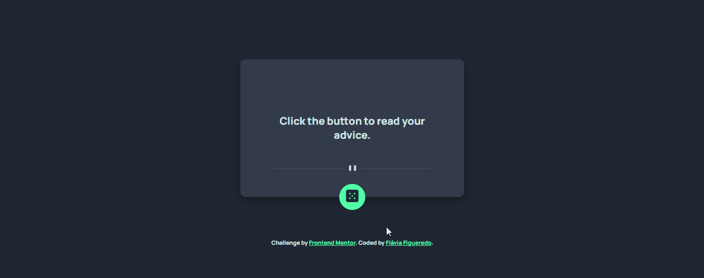

# Frontend Mentor - Advice generator app solution

### <i>Português:</i>
Essa é a solução para o [Desafio do aplicativo gerador de conselhos do Frontend Mentor](https://www.frontendmentor.io/challenges/advice-generator-app-QdUG-13db). 

Esse desafio foi proposto como exercício durante o curso DevQuest com o objetivo de construir essa aplicação consumindo a API de conselhos.

### <i>English:</i>
This is a solution to the [Advice generator app challenge on Frontend Mentor](https://www.frontendmentor.io/challenges/advice-generator-app-QdUG-13db). 

This challenge was proposed as an exercise during DevQuest classes in order to build this application using the Advice API.
________________________________________________

## Índice (Table of contents)

- [O desafio](#o-desafio) ([The challenge](#the-challenge))
- [Captura de tela](#captura-de-tela-screenshot) ([Screenshot](#captura-de-tela-screenshot))
- [Links](#links)
- [Construído com](#construído-com-built-with) ([Built with](#construído-com-built-with))
- [Autora](#autora-author) ([Author](#autora-author))
_________________________________________________

### <i>Português:</i>
### O desafio

Os usuários devem ser capazes de:

- Ver o layout ideal para o aplicativo, dependendo do tamanho da tela do dispositivo
- Ver os estados de foco para todos os elementos interativos na página
- Gerar um novo conselho clicando no ícone do dado

### <i>English:</i>
### The challenge
Users should be able to:

- View the optimal layout for the app depending on their device's screen size
- See hover states for all interactive elements on the page
- Generate a new piece of advice by clicking the dice icon
_________________________________________________

### Captura de tela (Screenshot)

__________________________________________________

### Links

- [Solução (Solution)](https://your-solution-url.com)
- [GitHub Pages](https://your-live-site-url.com)
__________________________________________________

### Construído com (Built with)

- HTML5
- CSS
- JavaScript
- API
__________________________________________________

## Autora (Author)

- Portfólio - [Flávia Figueredo](https://flaviafigueredo.github.io/mini-portfolio/)
- GitHub - [@flaviafigueredo](https://github.com/flaviafigueredo)